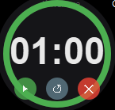

# Timer

Compact desktop timer for Windows with a circular progress indicator, sound alerts, and a floating always-on-top window.

## Screenshot

## Download

[Download Timer](https://github.com/milleran41/timer/raw/main/dist/timer.exe)

## System Requirements

- Platform: Windows 10/11 (64-bit)
- Download: Ready-to-run `.exe` for Windows

## How to use

1. Download `timer.exe`.
2. Open the program with a double-click.
3. Double-click the timer window to set hours, minutes, and seconds.
4. Press the left button to start or pause the timer.
5. Press the middle button to reset the timer.
6. Press the right button to close the program.

## Controls

- Double-click on the timer: open the time setup window
- Mouse wheel: change the timer value when it is not running
- Drag with the mouse: move the timer window on the screen

## Project files

- `timer.py`: source code
- `dist/timer.exe`: ready-to-run Windows build
